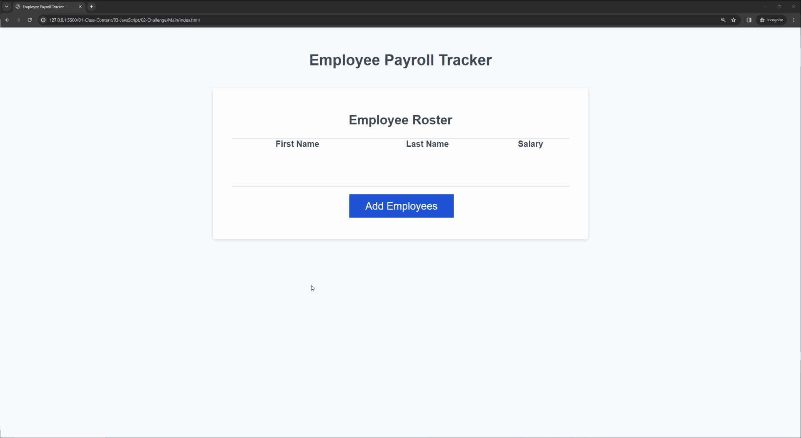
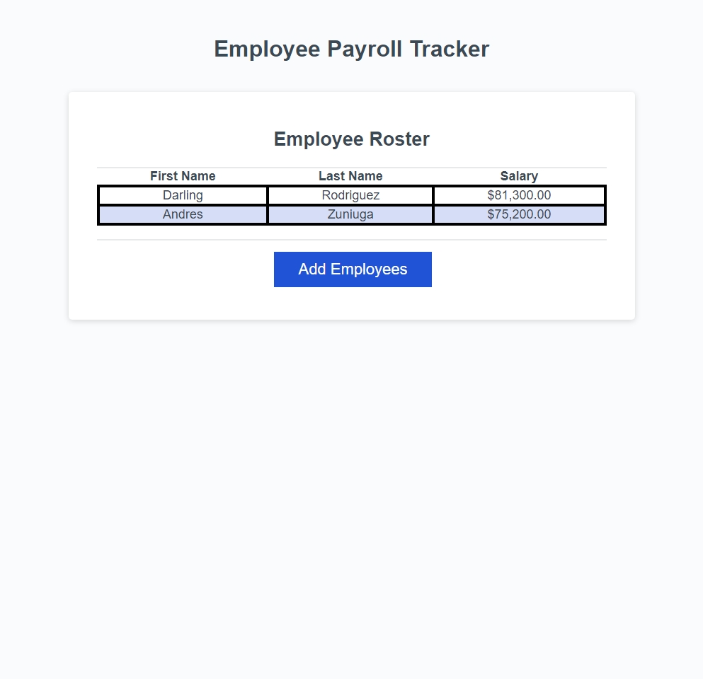

# Employee Payroll Tracker Starter Code (Module 3)

## Description

The Employee Payroll Tracker is a moslty JavaScript based web application. It allows users to manage information for the employee by stating there first name, last name, salary income. Youy can add multiple employees and calculates at the end.

## Acceptance Criteria

GIVEN an employee payroll tracker.
WHEN I click the "Add employee" button.
THEN I am presented with a series of prompts asking for first name, last name, and salary.
WHEN I finish adding an employee.
THEN I am prompted to continue or cancel.
WHEN I choose to continue.
THEN I am prompted to add a new employee.
WHEN I choose to cancel.
THEN my employee data is displayed on the page sorted alphabetically by last name, and the console shows computed and aggregated data.

* the image below shows how it should look like:

## installation

1. create a GitHub
2. clone the starter code into my repository
3. open on VScode and arrange the files
4. work on what needs to be added into the JavaScript
5. run and check the code

* The image shows my personal use of the Employee Payroll Tracker:

